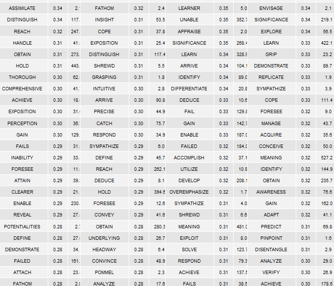
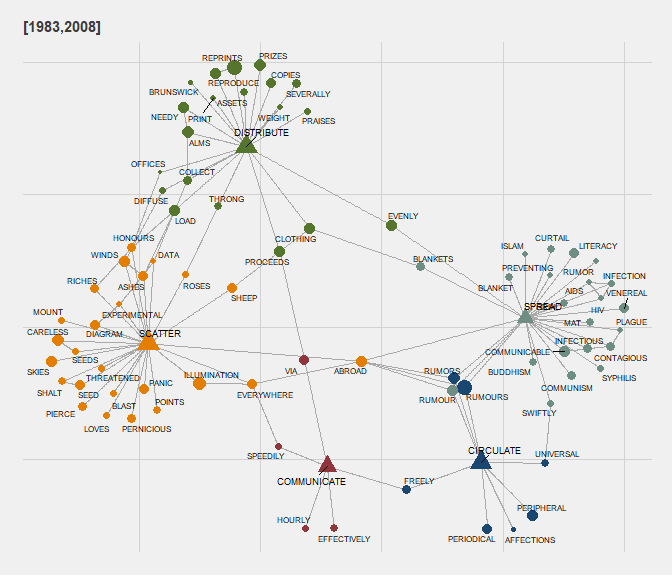
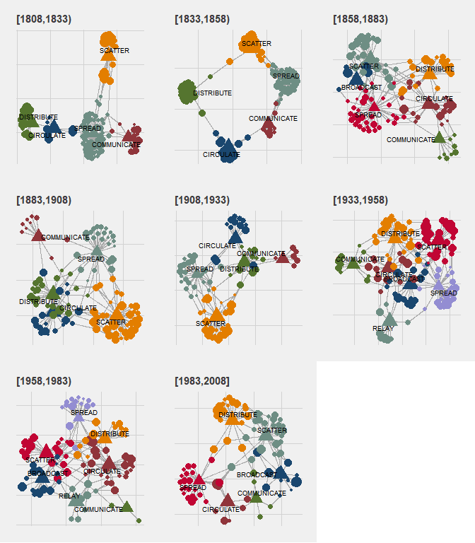
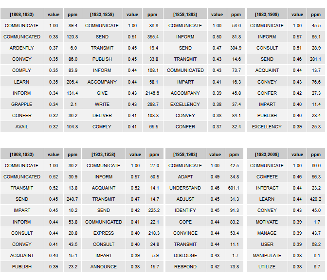

Google n-gram data & R: some methods & hacks
--------------------------------------------

An R-based guide to accessing/sampling Google n-gram data & building
historical term-feature matrices for investigating lexical semantic
change historically.

-   [0 The English One Million
    corpus](#0-The-English-One_Million-corpus)
-   [1 Download-Sample-Aggregate](#1-Download-Sample-Aggregate)
-   [2 Restructuring corpus](#2-Restructuring-corpus)
-   [3 Building historical term-feature
    matrices](#3-Building-historical-term-feature-matrices)
-   [4 Frequency and PPMI](#4-Frequency-and-PPMI)
-   [5 Exploring collocates
    historically](#5-Exploring-collocates-historically)
-   [6 Latent dimensions and SVD](#6-Latent-dimensions-and-SVD)
-   [7 Exploring synonymy
    historically](#7-Exploring-synonymy-historically)
-   [8 Summary](#8-Summary)

This guide focuses on working with Google n-gram data locally. So, lots
of sampling & intermediary file structures. A smarter approach to
working with n-gram data in its entirety would be to build a SQL
database. Here, we just want to steal some n-gram data to demonstrate a
few methods & take a peak into some changes in word distributions
historically.

Google n-gram data are a bit weird as a text structure. As such, many
existing text-analytic R packages/functions (that often assume raw text
as a starting point) are not especially helpful here. So, we have to
hack-about some to get from Google n-gram data to historical
term-feature matrices.

**ENDGAME:** Finding historical synonyms. The tables below summarize
nearest neighbors for the word *GRASP* over the last 200 years (by
quarter century), including cosine-based similarities (value) & term
frequencies in parts per million (ppm).

<br>



------------------------------------------------------------------------

### 0 The English One Million corpus

Google has a host of corpora – here we work with the corpus dubbed the
**English One Million** corpus. The corpus is comprised of texts
published from the 16th century to the start of the 21st, and includes
over 100 billion words. **The 5-gram corpus** is comprised of \~800
files (or sub-corpora). File composition for this corpus version is not
structured alphabetically or chronologically. Instead, it seems fairly
arbitrary.

``` r
library(tidyverse)
library(data.table)
```

Here, we summarize **corpus token composition** by quarter-century for
the most recent 200 years of text included in the corpus, which will be
our focus here.

``` r
weights <- read.csv(
  url('http://storage.googleapis.com/books/ngrams/books/googlebooks-eng-1M-totalcounts-20090715.txt'), 
                    sep = '\t', 
                    header = FALSE, 
                    skip = 1) %>%
  select(V1,V2) %>%
  rename(yop = V1, tokens = V2) %>%
  filter(yop >=1808 & yop <= 2008)

weights$quarter <- cut(weights$yop, seq(1808, 2008, 25), 
              right=FALSE,
              include.lowest = TRUE,
              dig.lab = 4) 

weights <- weights %>% 
  group_by(quarter) %>%
  summarise(tokens = sum(as.numeric(tokens))) %>%
  ungroup() %>%
  mutate(prop_tokens = round(tokens / sum(tokens),3))
```

| quarter       |       tokens|  prop\_tokens|
|:--------------|------------:|-------------:|
| \[1808,1833)  |   4480534918|         0.041|
| \[1833,1858)  |   9878122399|         0.090|
| \[1858,1883)  |  12841359542|         0.117|
| \[1883,1908)  |  17288373482|         0.157|
| \[1908,1933)  |  15101571498|         0.137|
| \[1933,1958)  |  16228180585|         0.147|
| \[1958,1983)  |  16127053472|         0.146|
| \[1983,2008\] |  18152970019|         0.165|

------------------------------------------------------------------------

### 1 Download-Sample-Aggregate

To start the sampling process, we build two simple functions. The
**first function** downloads & unzips a single file of the corpus to a
temporary folder.

``` r
get_zip_csv <- function (url) {

  temp <- tempdir()
  zip_name <- paste0(temp, '\\', basename(url))
  download.file(url, zip_name, 
                quiet = TRUE)
  unzip(zip_name, exdir = temp)
  setwd(temp) ##
  out <- data.table::fread(gsub('\\.zip', '', basename(url)), ## gsub('\\.zip', '', zip_name), 
                           blank.lines.skip = TRUE, 
                           quote="", 
                           encoding = 'UTF-8')
  unlink(temp) 
  out}
```

A **random portion** of the first file of the 5-gram corpus is presented
below:

-   V1 = 5-gram
-   V2 = Date of publication
-   V3 = token frequency of 5-gram in sub-corpus
-   V4 = page count of 5-gram in sub-corpus
-   V5 = volume (or text frequency) count of 5-gram in sub-corpus

``` r
url <- 'http://storage.googleapis.com/books/ngrams/books/googlebooks-eng-1M-5gram-20090715-1.csv.zip'
unzipped_eg <- get_zip_csv(url)  #~11 million rows.
unzipped_eg %>% sample_n(5) %>% knitr::kable()
```

| V1                      |    V2|   V3|   V4|   V5|
|:------------------------|-----:|----:|----:|----:|
| "with an innocent face  |  1970|    2|    2|    2|
| I to do so I            |  1932|    1|    1|    1|
| was a bit frightened of |  1995|    1|    1|    1|
| to protect them for a   |  2003|    1|    1|    1|
| "above the altar        |  1994|    1|    1|    1|

The **second function** performs a variety of tasks with the aim of
sampling & aggregating the raw 5-gram files. Function parameters &
details:

-   filter sub-corpus by dates of publication
-   sample sub-corpus
-   remove 5-ngrams with punctuation
-   create new time bins
-   aggregate 5-gram frequencies per new time bins
-   sample again

Sampling procedure could certainly be more systematic. Here, we are only
interested in token frequencies.

``` r
sample_ngram <- function (x, 
                          start_date, end_date, 
                          generation, 
                          samp1, samp2) {
  
  x <- x[V2 >= start_date & V2 <= end_date ]
  set.seed(99)
  x <- x[sample(1:nrow(x), samp1, 
                replace=FALSE),] 
  x <- x[grepl("^[a-z ]+$", V1, ignore.case = TRUE)] 
  #Remove grams with punctuation
  x$V9 <- cut(x$V2, seq(start_date,end_date,generation), 
              right=FALSE,
              include.lowest = TRUE,
              dig.lab = 4) #Create new time bins
  x[, V1 := toupper(V1)]
  x <- x[, list(V3 = sum(V3)), by = list(V1, V9)] 
  #Aggregate freqs to new time bins
  setnames(x, 
           old = c('V1', 'V9', 'V3'), 
           new = c('five_gram', 'quarter', 'freq'))
  set.seed(99)
  x[sample(1:nrow(x), samp2,
                replace=FALSE),]
}
```

**The table below** presents a random portion of the sampled/aggregated
output. (n-grams out of context are always perfect little poems.)

``` r
unzipped_eg %>%
  sample_ngram(start_date = 1808,
               end_date = 2008,
               generation = 25,
               samp1 = 5000000,
               samp2 = 200000) %>%
  sample_n(5) %>%
  knitr::kable()
```

| five\_gram                     | quarter       |  freq|
|:-------------------------------|:--------------|-----:|
| PLACES DISTANT FROM EACH OTHER | \[1933,1958)  |     3|
| THOSE IN THE LOWER GROUP       | \[1933,1958)  |    10|
| CANNOT EXIST INDEPENDENT OF A  | \[1833,1858)  |     3|
| TO VENICE AT THE END           | \[1983,2008\] |     4|
| THAT HE THOUGHT PROPER TO      | \[1958,1983)  |     5|

<br>

We then **apply functions** to all \~800 files/sub-corpora, and store
the output locally. Depending on connection speed, this could take a
while. A good processing rate would be 3/4 files per minute.
Downloading/unzipping is the limiting part of the process. Total size of
processed files is \~6.7 Gb.

``` r
file_names <- c(1:799)

for (i in 1:length(file_names)) {
  url <- paste0('http://storage.googleapis.com/books/ngrams/books/googlebooks-eng-1M-5gram-20090715-', file_names[i], '.csv.zip')
  
  xx <-   get_zip_csv(url) %>%
    sample_ngram(start_date = 1808,
                 end_date = 2008,
                 generation = 25,
                 samp1 = 5000000,
                 samp2 = 200000)
  setwd(local_raw)
  write.csv(xx, 
            gsub('(^.*googlebooks-)(.*)(\\.zip)', '\\2', url), 
            row.names = FALSE) 
  }
```

------------------------------------------------------------------------

### 2 Restructuring corpus

At this point, we have successfully stolen a very small portion (\~1%)
of the 5-gram corpus derived from the 100+ billion word Google corpus.
At \~6.7 Gb, it is still a bit big for use locally in R. With the goal
of building n-gram-based co-occurrence matrices, the next step is to
restructure the 5-gram data some.

Per each file/sub-corpus generated above, here we:

-   take a weighted sample 5-grams
-   uniquely id 5-grams
-   flip 5-grams as character string to long format
-   remove stop words

Per the table above, the 5-gram **BREAK ALL THE TEN COMMANDMENTS** (!)
occurred 4 times during the quarter-century spanning 1958-1983 in the
*first file* of the ngram corpus. The pipe below separates each form in
the ngram into five rows, assigns each row/form the frequency of the
ngram (4), uniquely identifies the ngram in the sub-corpus, and removes
rows in the ngram containing stopwords (here, “ALL” and “THE”). The ID
serves to preserve the ngram as a context of usage (or mini-text).

Note that sampling here is **weighted** based on the overall
quarter-century composition of the English One Million corpus. This is
n-gram based, and not n-gram/frequency based. Sampling procedure was
stolen from this [lovely
post](https://jennybc.github.io/purrr-tutorial/ls12_different-sized-samples.html).

``` r
gfiles <- list.files(path=local_raw, 
                     pattern = ".csv", 
                     recursive=TRUE) 

locs <- paste0(local_raw, gfiles)

grams <- lapply(1:length(locs), function (y)
  #Sample per jennybc
  data.table::fread(locs[y])%>%
    arrange(quarter) %>%
    group_by(quarter) %>%
    nest() %>%  
    ungroup() %>% ## This was issue detected 1/17/20 !!
    mutate(n = round(75000* weights$prop_tokens,0)) %>% 
    mutate(samp = map2(data, n, sample_n)) %>% 
    select(quarter, samp) %>%
    unnest() %>%
  
  #Restructure
    rename(ngram = five_gram) %>%
    mutate(id = as.integer(row_number())) %>%
    separate_rows (ngram, sep = ' ') %>% #Make ngram long
    filter(!ngram %in% toupper(corpuslingr::clr_ref_stops))%>% #Remove stop words
    ## Probably better to use tm::stopwords() !!!
    as.data.table()
)

names(grams) <- file_names
```

The **resulting data structure** is a list of data frames, with each
data frame representing a sub-corpus as a bag-of-words (with frequencies
aggregated by n-gram constituents and quarter-century). A sample portion
of this structure is presented below.

| ngram       | quarter       |  freq|   id|
|:------------|:--------------|-----:|----:|
| DESIRE      | \[1983,2008\] |    12|    1|
| KIND        | \[1983,2008\] |    12|    1|
| PROPOSAL    | \[1883,1908)  |     2|    2|
| STRENUOUSLY | \[1883,1908)  |     2|    2|
| OPPOSED     | \[1883,1908)  |     2|    2|
| NEW         | \[1983,2008\] |     1|    3|

The next step is to convert our list of randomly assembled sub-corpora
into a list of **generation-based** sub-corpora. So, we first collapse
our list of sub-corpora into a single corpus, and uniquely identify each
5-gram.

``` r
grams <- grams %>% data.table::rbindlist(idcol = 'corp') 
setkey(grams, corp, id)
grams[ , id := .GRP, by = key(grams)]
grams[, corp := NULL]  #nrow = 120,920,432
```

``` r
summary <- grams[, list(tokens = sum(freq), 
                        types = length(unique(ngram)),
                        ngrams = length(unique(id))), 
                 by=quarter] %>% 
  arrange(quarter)
```

While we are here, **some corpus descriptives**. These are rough
estimates. Keep in mind that the token count is a bit weird as it is
based on n-grams and, hence, a single instantiation of a form in text
will be counted multiple times (as it will occur in multiple n-grams).
Presumably relative frequencies wash the effects of multiple counting
out (assuming all forms are equally affected).

| quarter       |     tokens|  types|   ngrams|  prop\_tokens|  prop\_ngrams|
|:--------------|----------:|------:|--------:|-------------:|-------------:|
| \[1808,1833)  |   37383071|  50609|  2407235|         0.028|         0.041|
| \[1833,1858)  |  118606799|  67794|  5314405|         0.089|         0.090|
| \[1858,1883)  |  162203730|  77019|  6911847|         0.122|         0.117|
| \[1883,1908)  |  254298403|  86591|  9308212|         0.192|         0.157|
| \[1908,1933)  |  183793294|  80850|  8129058|         0.139|         0.137|
| \[1933,1958)  |  199018814|  81235|  8733809|         0.150|         0.147|
| \[1958,1983)  |  176878087|  80539|  8677454|         0.133|         0.146|
| \[1983,2008\] |  194605143|  82249|  9762528|         0.147|         0.165|

Lastly, we **re-split the corpus into eight sub-corpora**, one for each
quarter-century.

``` r
setorder(grams, quarter, id)
grams <- split(grams, f = grams$quarter) 
grams <- lapply(grams, select, -quarter) 
```

------------------------------------------------------------------------

### 3 Building historical term-feature matrices

At this point, we are finished with the time- & memory-consumptive
portion of the workflow. Next, we want to transform each of our
sub-corpora into a term-feature matrix (TFM).

Treating each uniquely identified 5-gram as a “document,” we first
transform each sub-corpus into a Document-Term Matrix (DTM) using the
`cast_sparse` function from the `tidytext` package. For our purposes
here, this is an intermediary data structure. We then convert the DTM to
a term-feature matrix using the `Dtm2Tcm` function from the `testmineR`
package. This particular workflow is ideal when working with aggregated
text structures as a starting point.

``` r
tfms <- lapply(1:8, function (y)
  
  grams[[y]] %>%
    tidytext::cast_sparse(id, 
                          ngram, 
                          freq) %>%
    textmineR::Dtm2Tcm() %>%
    .[, order(colnames(.))] %>%
    .[order(rownames(.)), ]
  
) #632.2 Mb

names(tfms) <- names(grams)
```

A small portion of the TFM for the **1908-1932** sub-corpus is presented
below.

``` r
library(Matrix)
tfms[[5]][1:10,1:15] 
```

    ## 10 x 15 sparse Matrix of class "dgCMatrix"
    ##                                             
    ## AA    100 . . .  .   . .    . .  . . . . . .
    ## AAA     . 1 . .  .   . .    . .  . . . . . .
    ## AAAS    . . 1 .  .   . .    . .  . . . . . .
    ## AAE     . . . 2  .   . .    . .  . . . . . .
    ## AAR     . . . . 43   . .    . .  . . . . . .
    ## AARON   . . . .  . 737 .    . .  . . . . . .
    ## AASI    . . . .  .   . 1    . .  . . . . . .
    ## AB      . . . .  .   . . 2406 .  . . . . . .
    ## ABABA   . . . .  .   . .    . 3  . . . . . .
    ## ABACI   . . . .  .   . .    . . 46 . . . . .

**Full data structure** is a list of TFMs by quarter-century, with the
following dimensions:

| quarter       |  terms|  features|
|:--------------|------:|---------:|
| \[1808,1833)  |  50609|     50609|
| \[1833,1858)  |  67794|     67794|
| \[1858,1883)  |  77019|     77019|
| \[1883,1908)  |  86591|     86591|
| \[1908,1933)  |  80850|     80850|
| \[1933,1958)  |  81235|     81235|
| \[1958,1983)  |  80539|     80539|
| \[1983,2008\] |  82249|     82249|

------------------------------------------------------------------------

### 4 Frequency and PPMI

At this point, our historical TFMs are quite large, and include
terms/features that are super infrequent. Here, we extract historical
frequencies from matrix diagonals to enable frequency-based filtering of
matrix composition.

``` r
freqs_by_gen <- lapply(1:8, function (x)
  data.frame(form = rownames(tfms[[x]]), 
             freq = diag(tfms[[x]]),
             quarter = rep(names(tfms[x]), nrow(tfms[[x]])),
             stringsAsFactors = FALSE) 
  ) %>%
  bind_rows() %>%
  group_by(quarter) %>%
  mutate(corpus = sum(freq)) %>%
  ungroup() %>%
  mutate(ppm = round(freq/corpus * 1000000, 2))%>%
  select(-corpus)
```

**Historical frequencies** for a small set of forms in the sampled
n-gram corpus are presented below. Note that these frequencies are very
rough, and will differ some from numbers obtained directly from Google’s
n-gram viewer (per sampling procedure & aggregated time bins).

``` r
set.seed(199)
freqs_by_gen %>%
  select(-freq) %>%
  spread(quarter, ppm) %>%
  sample_n(5) %>%
  knitr::kable()
```

| form       |  \[1808,1833)|  \[1833,1858)|  \[1858,1883)|  \[1883,1908)|  \[1908,1933)|  \[1933,1958)|  \[1958,1983)|  \[1983,2008\]|
|:-----------|-------------:|-------------:|-------------:|-------------:|-------------:|-------------:|-------------:|--------------:|
| NESS       |          0.86|          0.30|          0.64|          0.26|          0.30|          0.09|          0.15|           0.18|
| FAMILLE    |          0.03|            NA|          0.04|          0.22|          0.13|          0.10|          0.14|           0.15|
| COMPRADOR  |            NA|            NA|            NA|            NA|            NA|            NA|          0.18|           0.08|
| DENOUNCING |          1.07|          1.06|          1.52|          1.35|          0.91|          0.57|          0.62|           0.40|
| MEAN       |        443.86|        298.08|        380.18|        364.41|        444.72|        591.75|        556.08|         630.70|

Per table above, some weird & infrequent forms in our matrices. Below we
create a list of forms that occur greater than 1.5 ppm for each
quarter-century. This count will vary by time point.

``` r
filts <- freqs_by_gen %>%
  group_by(form, quarter) %>%
  filter (ppm > 1.5) %>%
  ungroup() %>%
  select(quarter, form)

filts <- split(filts, f = filts$quarter)
```

**Limit terms & features** to forms occurring greater than 1.5 ppm:

``` r
tfms_filtered <- lapply(1:8, function (x)
  tfms[[x]][rownames(tfms[[x]]) %in% filts[[x]]$form,
            colnames(tfms[[x]]) %in% filts[[x]]$form])
names(tfms_filtered) <- names(tfms)
```

**Dimension details** for our new matrices are presented below.

| quarter       |  terms|  features|
|:--------------|------:|---------:|
| \[1808,1833)  |  18186|     18186|
| \[1833,1858)  |  18495|     18495|
| \[1858,1883)  |  18878|     18878|
| \[1883,1908)  |  18748|     18748|
| \[1908,1933)  |  17215|     17215|
| \[1933,1958)  |  16838|     16838|
| \[1958,1983)  |  16492|     16492|
| \[1983,2008\] |  16354|     16354|

Next, we convert our frequency-based co-occurrence matrices to
**positive pointwise mutual information** (PPMI) matrices. The function
below calculates PPMI values for sparse matrices, which is based on code
from an SO post available
[here](https://stackoverflow.com/questions/43354479/how-to-efficiently-calculate-ppmi-on-a-sparse-matrix-in-r),
and cached in my package `lexvarsdatr`.

``` r
devtools::install_github("jaytimm/lexvarsdatr")
```

``` r
tfms_ppmi <- lapply(tfms_filtered, lexvarsdatr::lvdr_calc_ppmi)
names(tfms_ppmi) <- names(tfms)
```

------------------------------------------------------------------------

### 5 Exploring collocates historically

With PPMI matrices, we can now investigate historical collocation
patterns. I have developed a simple function for extracting (sub-)
network structures from square sparse matrices for a given form or set
of forms, dubbed `lexvarsdatr::lvdr_extract_network`. Output inlcudes a
list of nodes and edges structured to play nice with the
`tidygraph`/`ggraph` network plotting paradigm.

The number of nodes (per term) to include in the network is specified by
the n parameter, ie, the n highest scoring features associated with a
term from a term-feature matrix. Term-nodes and feature-nodes are
distinguished in the output for visualization purposes. If multiple
terms are specified, nodes are filtered to the strongest (ie, primary)
term-feature relationships (to remove potential duplicates). Edges
include the n-highest scoring term-feature associations for specified
terms, as well as the n most frequent node-node associations per node
(term & feature).

Note: In general, it probably makes more sense to use the `igraph`
package for extracting subgraphs from larger networks. The approach
presented here is super-informal & aimed at quick visualization, as
opposed to investigating, eg, more formal network properties.

Here, we build a network structure for a set of forms with some
overlapping semantic structure.

``` r
search1 <-  c('SPREAD',
              'DISTRIBUTE', 
              'CIRCULATE', 
              'SCATTER', 
              'COMMUNICATE') 
         
net1 <- lapply (tfms_ppmi, lexvarsdatr::lvdr_extract_network, 
                target = search1, 
                n = 15)
```

Via `tidygraph`, `ggraph` & `gridExtra`, we plot the evolution of the
collocational structure among our set of terms over time.

``` r
g <- list(length(net1))
set.seed(999)
for (i in 1:length(net1)) {
  g[[i]] <- net1[[i]] %>%
    tidygraph::as_tbl_graph() %>%
      ggraph::ggraph() +
      ggraph::geom_edge_link(color = 'darkgray') + #alpha = 0.8
      ggraph::geom_node_point(aes(size = value, 
                                  color = term,
                                  shape = group)) +
      ggraph::geom_node_text(aes(label = label, 
                                 filter = group == 'term'), 
                             repel = TRUE, size = 2.35)+
      ggthemes::scale_color_stata()+
      ggthemes::theme_fivethirtyeight() +
      ggtitle(names(net1[i]))+
      theme(legend.position = "none",
            plot.title = element_text(size=11),
            axis.text.x = element_blank(),
            axis.text.y = element_blank())
}

gridExtra::grid.arrange(grobs = g, nrow = 3)
```



**For a more detailed perspective**, we plot the network structure among
terms & collocates for the most contemporary quarter-century.

``` r
g[[8]]+
      ggraph::geom_node_text(aes(label = label, 
                                 filter = group == 'feature'), 
                             repel = TRUE, size = 2)
```



------------------------------------------------------------------------

### 6 Latent dimensions and SVD

To investigate synonymy/nearest neighbors historically, we first need to
homogenize the feature-composition of our historical PPMI TFMs – in
other words, we want term embeddings to be comprised of the same
features historically.

Based on the frequencies derived above, we create a list of forms that
occur in every quarter-century; then we filter these forms to the 50th
to 5,049th most frequent based on median frequencies historically. Then
we subset feature composition of the PPMI TFMs to include only these
forms.

``` r
filtered_features <- freqs_by_gen %>%
  group_by(form) %>%
  mutate(quarter_count = length(quarter),
         ppm = median(ppm)) %>%
  filter (quarter == "[1983,2008]", quarter_count == 8)%>%
  arrange (desc(ppm)) %>%
  ungroup() %>%
  slice(50:5049)

tfms_for_svd <- lapply(1:8, function (x)
  tfms_ppmi[[x]][, colnames(tfms_ppmi[[x]]) %in% filtered_features$form])
names(tfms_ppmi) <- names(tfms)
```

Next, we compress our matrices comprised of 5k features to **250 latent
dimensions** via singular value decomposition (SVD) & the `irlba`
package. The number of dimensions selected here is largely arbitrary.

``` r
tfms_svd <- lapply(tfms_for_svd, irlba::irlba, nv = 250) 
```

Lastly, we extract the **approximate left singular values** from the SVD
object for each TFM as a simple matrix.

``` r
tfms_mats <- list()

for (i in 1:8) {
  x <- as.matrix(data.matrix(tfms_svd[[i]]$u))
  dimnames(x) <- list(rownames(tfms_ppmi[[i]]), c(1:length(tfms_svd[[i]]$d)))
  tfms_mats[[i]] <- x
}
```

------------------------------------------------------------------------

### 7 Exploring synonymy historically

Finally, we are cooking with gas. Using the `neighbors` function from
the `LSAfun` package, we extract historical nearest neighbors (via
cosine-based similarities) from our SVD matrices for the form
*COMMUNICATE*.

``` r
x <- lapply(tfms_mats, LSAfun::neighbors, 
            x = toupper('communicate'), 
            n = 10)
```

Output from the call to `neighbors` ia a bit messy – the function below
converts this output to a cleaner data structure.

``` r
strip_syns <- function (x) {
  lapply(1:length(x), function(y)  
    x[[y]] %>%
    as_tibble(rownames = NA)  %>% 
    rownames_to_column(var = 'form') %>%
    mutate (quarter = names(x[y]),
            value = round(value,2))) %>%
    bind_rows() }
```

Below we apply function, and add **nearest neighbor historical
frquencies** for good measure.

``` r
syns <- x %>% strip_syns() %>%
  inner_join(freqs_by_gen) %>%
  mutate(ppm = round(ppm, 1)) %>%
  select(-freq) %>%
  group_by(quarter) %>%
  arrange(desc(value))%>%
  ungroup()
```

With some help from `gridExtra`, we plot nearest neighbors as a
collection of tables.

``` r
g <- list(length(tfms_mats))
tt <- gridExtra::ttheme_default(base_size = 7)

for (i in 1:length(tfms_mats)) {
  g[[i]] <- syns %>% 
    filter (quarter == names(tfms_mats[i])) %>%
    rename(!!names(tfms_mats[i]) := form) %>% 
    select(-quarter)%>%
    gridExtra::tableGrob(rows=NULL, theme = tt) }

gridExtra::grid.arrange(grobs = g, nrow = 2)
```



------------------------------------------------------------------------

### 8 Summary

While linguists are often critical of Google n-gram data, it is still an
incredible (cultural & linguistic) resource. Despite a fairly small
sample of the full English One Million n-gram data set, we still get
some fairly nice & intuitive results for synonyms/nearest neighbors.
Certainly useful for exploratory purposes, as well as general
pedagogical purposes.

Word embeddings based on the 1% sample of the English One Million corpus
are available
[here](https://github.com/jaytimm/google_ngrams_and_R/tree/master/google_one_percent_embeddings).
For a demonstration on aligning historical word embeddings and
visualizing lexical semantic change, see this
[post](https://www.jtimm.net/2019/04/14/lexical-change-procrustes/).
