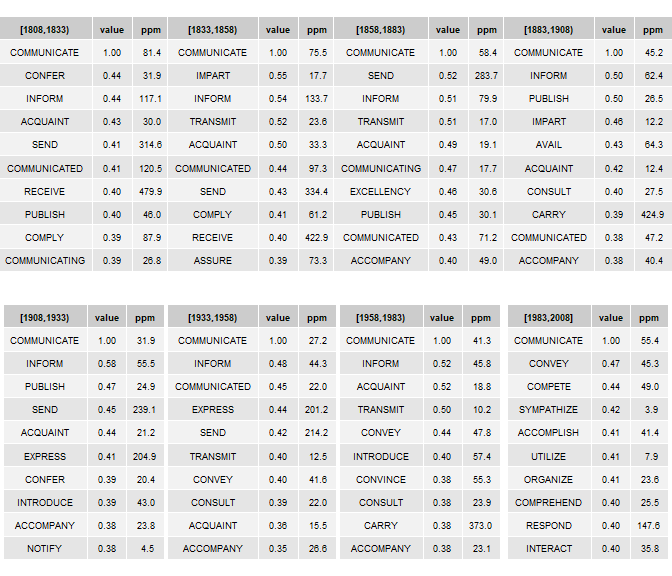

Google n-gram data & R: some methods
------------------------------------

An R-based guide to accessing/sampling Google n-gram data & building historical term-feature matrices for investigating lexical semantic change historically.

-   [1 Download-Sample-Aggregate](#1-Download-Sample-Aggregate)
-   [2 Restructuring corpus](#2-Restructuring-corpus)
-   [3 Building historical term-feature matrices](#3-Building-historical-term-feature-matrices)
-   [4 Filtering historical term-feature matrices](#4-Filtering-historical-term-feature-matrices)
-   [5 PPMI and SVD](#5-PPMI-and-SVD)
-   [6 Exploring synonymny historically](#6-Exploring-synonymny-historically)
-   [7 Summary](#7-Summary)

This guide focuses on working with Google n-gram data locally. So, lots of sampling & intermediary file structures. A smarter aproach to working with n-gram data in its entriety would be to build a SQL database. Here, we just want to steal some n-gram data to demonstrate a few methods & take a peak into some changes in word distributions historically.

Google n-gram data are a bit weird as a text structure. As such, many existing text-analytic R packages/functions (that often assume raw text as a starting point) are not especially helpful here. So, we have to hack-about some to get from Google n-gram data to historical term-feature matrices.

**ENDGAME:** Finding historical synonyms (-ish). The tables below summarize nearest neighbors for the word *GRASP* over the last 200 years (by quarter century), including cosine-based similarities (value) & term frequencies in parts per million (ppm).

<br>


------------------------------------------------------------------------

### 1 Download-Sample-Aggregate

Google has a host of corpora -- here we work with the corpus dubbed the **English One Million** corpus. The corpus is comprised of texts published from the 16th century to the start of the 21st, and includes over 100 billion words. **The 5-gram corpus** is comprised of ~800 files (or sub-corpora). File composition for this corpus version is not structured alpabetically or chronologically. Instead, it seems fairly arbitrary.

``` r
library(tidyverse)
library(data.table)
```

To start the sampling process, we build two simple functions. The **first function** downloads & unzips a single file of the corpus to a temporary folder.

``` r
get_zip_csv <- function (url) {

  temp <- tempdir()
  zip_name <- paste0(temp, '\\', basename(url))
  download.file(url, zip_name, 
                quiet = TRUE)
  unzip(zip_name, exdir = temp)
  out <- data.table::fread(gsub('\\.zip', '', zip_name), 
                           blank.lines.skip = TRUE, 
                           quote="", 
                           encoding = 'UTF-8')
  unlink(temp) 
  out}
```

A **random portion** of the first file of the 5-gram corpus is presented below:

-   V1 = 5-gram
-   V2 = Date of publication
-   V3 = token frequency of 5-gram in sub-corpus
-   V4 = page count of 5-gram in sub-corpus
-   V5 = volume (or text frequency) count of 5-gram in sub-corpus

``` r
url <- 'http://storage.googleapis.com/books/ngrams/books/googlebooks-eng-1M-5gram-20090715-1.csv.zip'
unzipped_eg <- get_zip_csv(url)  #~11 million rows.
unzipped_eg %>% sample_n(5) %>% knitr::kable()
```

| V1                               |    V2|   V3|   V4|   V5|
|:---------------------------------|-----:|----:|----:|----:|
| "subjects . Indeed               |  1875|    1|    1|    1|
| in the States of his             |  1949|    1|    1|    1|
| he came back home .              |  1944|    2|    2|    2|
| demonstrated the accuracy of the |  1886|    4|    4|    4|
| time and space . We              |  1924|    7|    7|    6|

The **second function** performs a variety of tasks with the aim of sampling & aggregating the raw 5-gram files. Function parameters & details:

-   filter sub-corpus by dates of publication
-   sample sub-corpus
-   remove 5-ngrams with punctuation
-   create new time bins
-   aggregate 5-gram frequencies per new time bins
-   sample again

Sampling procedure could certainly be more systematic. Here, we are only interested in token frequencies.

``` r
sample_ngram <- function (x, 
                          start_date, end_date, 
                          generation, 
                          samp1, samp2) {
  
  x <- x[V2 >= start_date & V2 <= end_date ]
  set.seed(99)
  x <- x[sample(1:nrow(x), samp1, 
                replace=FALSE),] 
  x <- x[grepl("^[a-z ]+$", V1, ignore.case = TRUE)] 
  #Remove grams with punctuation
  x$V9 <- cut(x$V2, seq(start_date,end_date,generation), 
              right=FALSE,
              include.lowest = TRUE,
              dig.lab = 4) #Create new time bins
  x[, V1 := toupper(V1)]
  x <- x[, list(V3 = sum(V3)), by = list(V1, V9)] 
  #Aggregate freqs to new time bins
  setnames(x, 
           old = c('V1', 'V9', 'V3'), 
           new = c('five_gram', 'quarter', 'freq'))
  set.seed(99)
  x[sample(1:nrow(x), samp2,
                replace=FALSE),]
}
```

The table below presents a random portion of the sampled/aggregated output:

``` r
unzipped_eg %>%
  sample_ngram(start_date = 1808,
               end_date = 2008,
               generation = 25,
               samp1 = 5000000,
               samp2 = 200000) %>%
  sample_n(5) %>%
  knitr::kable()
```

| five\_gram                     | quarter      |  freq|
|:-------------------------------|:-------------|-----:|
| IN THE AGGREGATE TO FIVE       | \[1858,1883) |     7|
| BREAK ALL THE TEN COMMANDMENTS | \[1958,1983) |     4|
| THAT TIME HE WAS WELL          | \[1858,1883) |     3|
| OF HIS EXPERIMENTS AND THEIR   | \[1908,1933) |     3|
| AS SOON AS ORDER WAS           | \[1933,1958) |    16|

<br>

We then **apply functions** to all ~800 files/sub-corpora, and store the output locally. Depending on connection speed, this could take a while. A good processing rate would be 3/4 files per minute. Downoading/unzipping is the limiting part of the process. Total size of processed files is ~6.7 Gb.

``` r
file_names <- c(1:799)
setwd(local_raw)

for (i in 1:length(file_names)) {
  url <- paste0('http://storage.googleapis.com/books/ngrams/books/googlebooks-eng-1M-5gram-20090715-', file_names[i], '.csv.zip')
  
  get_zip_csv(url) %>%
    sample_ngram(start_date = 1808,
                 end_date = 2008,
                 generation = 25,
                 samp1 = 5000000,
                 samp2 = 200000)%>%
    write.csv(., 
            gsub('(^.*googlebooks-)(.*)(\\.zip)', '\\2', url), 
            row.names = FALSE) 
  }
```

------------------------------------------------------------------------

### 2 Restructuring corpus

At this point, we have successfully stolen a very small portion of the 5-gram corpus derived from the 100+ billion word Google corpus. At ~6.7 Gb, it is still a bit big for use locally in R. With the goal of building n-gram-based co-occurence matrices, the next step is to restructure the 5-gram data some.

Per each file/sub-corpus generated above, here we:

-   sample 5-grams again
-   uniquely id 5-grams
-   flip 5-grams as character string to long format
-   remove stop words

Per the table above, the 5-gram **BREAK ALL THE TEN COMMANDMENTS** occurred 4 times during the quarter-century spanning 1958-1983 in the *first file* of the ngram corpus. The pipe below seperates each form in the ngram into five rows, assigns each row/form the frequency of the ngram (4), uniquely identifies the ngram in the sub-corpus, and removes rows in the ngram containing stopwords (here, "ALL" and "THE"). The ID serves to preserve the ngram as a context of usage (or mini-text).

``` r
setwd(local_raw)
gfiles <- list.files(path=local_raw, 
                     pattern = ".csv", 
                     recursive=TRUE) 

grams <- lapply(1:length(gfiles), function (y)
  data.table::fread(gfiles[y])%>% 
    #filter(!quarter %in% c("[1808,1833)", "[1833,1858)")) %>%
    sample_n(75000) %>%
    rename(ngram = five_gram) %>%
    mutate(id = as.integer(row_number())) %>%
    separate_rows (ngram, sep = ' ') %>% #Make ngram long
    filter(!ngram %in% toupper(corpuslingr::clr_ref_stops))%>% #Remove stop words
    as.data.table()
)

names(grams) <- file_names  #Store locally.
```

The **resulting data structure** is a list of data frames, with each data frame representing a sub-corpus as a bag-of-words (with frequencies aggregated by ngram constituents and quarter-century). A sample portion of this structure is presented below.

| ngram       | quarter       |  freq|   id|
|:------------|:--------------|-----:|----:|
| DESIRE      | \[1983,2008\] |    12|    1|
| KIND        | \[1983,2008\] |    12|    1|
| PROPOSAL    | \[1883,1908)  |     2|    2|
| STRENUOUSLY | \[1883,1908)  |     2|    2|
| OPPOSED     | \[1883,1908)  |     2|    2|
| NEW         | \[1983,2008\] |     1|    3|

The next step is to convert our list of randomly assembled sub-corpora into a list of generation-based sub-corpora. So, we first collapse our list of sub-corpora into a single corpus, and uniquely identify each 5-gram.

``` r
grams <- grams %>% data.table::rbindlist(idcol = 'corp') 
setkey(grams, corp, id)
grams[ , id := .GRP, by = key(grams)]
grams[, corp := NULL]  #n = 120,920,432
```

``` r
summary <- grams[, list(freq = sum(freq), type=length(unique(ngram))), by=quarter] %>% 
  arrange(quarter)
```

**Some corpus descriptives**. These are rough estimates. Keep in mind that

| quarter       |       freq|   type|
|:--------------|----------:|------:|
| \[1808,1833)  |   66183994|  59767|
| \[1833,1858)  |  147983804|  72567|
| \[1858,1883)  |  184728372|  80140|
| \[1883,1908)  |  238699208|  85044|
| \[1908,1933)  |  190794906|  81840|
| \[1933,1958)  |  184923418|  79384|
| \[1958,1983)  |  159967871|  78302|
| \[1983,2008\] |  145837999|  75723|

Then we re-split the corpus into eight sub-corpora, one for each quarter-century.

``` r
setorder(grams, quarter, id)
grams <- split(grams, f = grams$quarter) 
grams <- lapply(grams, select, -quarter) 
```

------------------------------------------------------------------------

### 3 Building historical term-feature matrices

At this point, we are finished with the time- & memory-consumptive portion of the workflow. Next, we want to transform each of our sub-corpora into a term-feature matrix (TFM).

Treating each uniquely identified 5-gram as a "document," we first transform each sub-corpus into a Document-Term Matrix (DTM) using the `cast_sparse` function from the `tidytext` package. For our purposes here, this is an intermediary data structure. We then convert the DTM to a term-feature matrix using the `Dtm2Tcm` function from the `testmineR` package. This particular workflow is ideal when working with aggregated text structures as a starting point.

``` r
tfms <- lapply(1:8, function (y)
  
  grams[[y]] %>%
    tidytext::cast_sparse(id, 
                          ngram, 
                          freq) %>%
    textmineR::Dtm2Tcm() %>%
    .[, order(colnames(.))] %>%
    .[order(rownames(.)), ]
  
) #543.1Mb

names(tfms) <- names(grams)
```

A small portion of the TFM for the 1908-1932 sub-corpus is presented below. Full data structure is a list of TFMs by quarter-century.

``` r
library(Matrix)
tfms[[5]][1:10,1:15] 
```

    ## 10 x 15 sparse Matrix of class "dgCMatrix"
    ##                                             
    ## AA        153 . .  . .   . . . . . . . . . .
    ## AALAND      . 4 .  . .   . . . . . . . . . .
    ## AAN         . . 5  . .   . . . . . . . . . .
    ## AAR         . . . 31 .   . . . . . . . . . .
    ## AARNE       . . .  . 1   . . . . . . . . . .
    ## AARON       . . .  . . 822 . . . . . . . . .
    ## AARONIC     . . .  . .   . 1 . . . . . . . .
    ## AARONSOHN   . . .  . .   . . 1 . . . . . . .
    ## AASOR       . . .  . .   . . . 1 . . . . . .
    ## AAZAZ       . . .  . .   . . . . 1 . . . . .

------------------------------------------------------------------------

### 4 Filtering historical term-feature matrices

At present, our historical TFMs have the following dimensions:

``` r
lapply(tfms, dim) 
```

| quarter       |   term|  feature|
|:--------------|------:|--------:|
| \[1808,1833)  |  59767|    59767|
| \[1833,1858)  |  72567|    72567|
| \[1858,1883)  |  80140|    80140|
| \[1883,1908)  |  85044|    85044|
| \[1908,1933)  |  81840|    81840|
| \[1933,1958)  |  79384|    79384|
| \[1958,1983)  |  78302|    78302|
| \[1983,2008\] |  75723|    75723|

So, each historical TFM is quite large (~75k x 75k), and comprised of a unique set of terms & features.

However, two issues remain:

-   First, the actual term & feature composition of each matrix is still different. While differing number of terms is not necessarily problematic, we want term embeddings to be comprised of the same features historically.

-   Second, our matrices are still comprised of a substantial number of features, making for super-sparse term vectors.

To address the first issue, we limit features to only those that occur in every quarter-century of the full corpus. To address the second issue, we limit features to only those that occur within a given frequency range. Below, we extract form frequencies from each quarter-century TFM via matrix diagonals.

``` r
freqs_by_gen <- lapply(1:8, function (x)
  data.frame(lemma = rownames(tfms[[x]]), 
             freq = diag(tfms[[x]]),
             quarter = rep(names(tfms[x]), nrow(tfms[[x]])),
             stringsAsFactors = FALSE) 
  ) %>%
  bind_rows() %>%
  group_by(quarter) %>%
  mutate(corpus = sum(freq)) %>%
  ungroup() %>%
  mutate(ppm = round(freq/corpus *1000000, 2))%>%
  select(-corpus)
```

Historical frequencies for a small set of forms in the sampled n-gram corpus are presented below. Note that these frequencies are very rough, and will differ some from numbers obtained directly from Google's n-gram viewer.

``` r
freqs_by_gen %>%
  select(-freq) %>%
  spread(quarter, ppm) %>%
  sample_n(5) %>%
  knitr::kable()
```

| lemma        |  \[1808,1833)|  \[1833,1858)|  \[1858,1883)|  \[1883,1908)|  \[1908,1933)|  \[1933,1958)|  \[1958,1983)|  \[1983,2008\]|
|:-------------|-------------:|-------------:|-------------:|-------------:|-------------:|-------------:|-------------:|--------------:|
| PRETOR       |            NA|            NA|            NA|          0.06|            NA|            NA|            NA|             NA|
| SIERPE       |          0.12|          0.12|            NA|            NA|            NA|            NA|            NA|             NA|
| ENCYCLOPEDIC |            NA|          0.09|          0.04|          0.08|          0.03|          0.16|          0.31|           0.17|
| EUMENES      |          0.18|          0.12|          0.15|          0.03|          0.02|          0.01|            NA|             NA|
| BUFFALO      |          1.24|         10.87|          9.93|          7.80|          9.65|          5.86|          7.71|           5.19|

**Filtering features**. Based on the frequency table above, we create a list of forms that occur in every quarter-century; then we filter these forms to the 50th to 5,049th most frequent based on median frequencies historically.

``` r
filtered_features <- freqs_by_gen %>%
  group_by(lemma) %>%
  mutate(quarter_count = length(quarter),
         ppm = median(ppm)) %>%
  filter (quarter == "[1983,2008]", quarter_count == 8)%>%
  arrange (desc(ppm)) %>%
  ungroup() %>%
  slice(50:5049) 
```

**Filtering terms**.

``` r
filtered_terms <- freqs_by_gen %>%
  group_by(lemma, quarter) %>%
  filter (ppm > 1.5) %>%
  ungroup() %>%
  select(quarter, lemma)

filtered_terms <- split(filtered_terms, f = filtered_terms$quarter)
```

Then we subset features in the set of lemmatized TFMs. The result is 8 new TFMs, *n* x 5,000 in dimension.

``` r
tfms_filtered <- lapply(1:8, function (x)
  tfms[[x]][rownames(tfms[[x]]) %in% filtered_terms[[x]]$lemma,
            colnames(tfms[[x]]) %in% filtered_features$lemma])
names(tfms_filtered) <- names(tfms)
```

``` r
lapply(tfms_filtered, dim)
```

| quarter       |   term|  feature|
|:--------------|------:|--------:|
| \[1808,1833)  |  18309|     5000|
| \[1833,1858)  |  18528|     5000|
| \[1858,1883)  |  18895|     5000|
| \[1883,1908)  |  18764|     5000|
| \[1908,1933)  |  17262|     5000|
| \[1933,1958)  |  16846|     5000|
| \[1958,1983)  |  16480|     5000|
| \[1983,2008\] |  16402|     5000|

------------------------------------------------------------------------

### 5 PPMI and SVD

Whether or not some or all of the compression steps presented above, ...

*Positive Pointwise Mutual Information* (PPMI)

The function below calculates PPMI values on sparse matrices, which has been slightly modified from an SO post available [here](https://stackoverflow.com/questions/43354479/how-to-efficiently-calculate-ppmi-on-a-sparse-matrix-in-r).

Apply function to the list of quarter-century sparse matrices. Here we use the lemmatized/feature-filtered list, although rawer renditions can be used as well.

``` r
tfms_ppmi <- lapply(tfms_filtered, lexvarsdatr::lvdr_build_sparse_ppmi)
```

*Singular value decomposition*

``` r
tfms_svd <- lapply(tfms_ppmi, irlba::irlba, nv = 250) 
```

------------------------------------------------------------------------

### 6 Exploring synonymny historically

Simple matrix.

``` r
tfms_mats <- list()

for (i in 1:8) {
  x <- as.matrix(data.matrix(tfms_svd[[i]]$u))
  dimnames(x) <- list(rownames(tfms_ppmi[[i]]), c(1:length(tfms_svd[[i]]$d)))
  tfms_mats[[i]] <- x
}
```

Using the `neighbors` function from the `LSAfun` package.

``` r
x <- lapply(tfms_mats, LSAfun::neighbors, 
            x = toupper('communicate'), 
            n = 100)
```

Clean output.

``` r
strip_syns <- function (x) {
  lapply(1:length(x), function(y)  
    x[[y]] %>%
    as.tibble %>% 
    rownames_to_column(var = 'lemma') %>%
    mutate (quarter = names(x[y]),
            value = round(value,2))) %>%
    bind_rows() }
```

Add frequencies, and filter neighbors

``` r
syns <- x %>% strip_syns() %>%
  inner_join(freqs_by_gen) %>%
  mutate(ppm = round(ppm, 1)) %>%
  select(-freq) %>%
  group_by(quarter) %>%
  arrange( desc(value))%>%
  slice(1:10)%>%
  ungroup()
```

Plot below...

``` r
g <- list(length(tfms_mats))
tt <- gridExtra::ttheme_default(base_size = 7)

for (i in 1:length(tfms_mats)) {
  g[[i]] <- syns %>% 
    filter (quarter == names(tfms_mats[i])) %>%
    rename(!!names(tfms_mats[i]) := lemma) %>% 
    select(-quarter)%>%
    gridExtra::tableGrob(rows=NULL, theme = tt) }

gridExtra::grid.arrange(grobs = g, nrow = 2)
```



------------------------------------------------------------------------

### 7 Summary

While academic linguists (of the functional/cognitive/usage-based varieties) are often critical of Google n-gram data, it is still an incredible cultural resource.

Many of the methodological decisions made here can certainly be tweaked to improve results.
