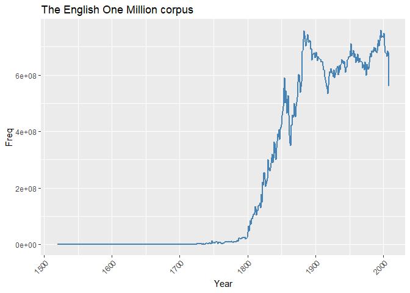

Google n-gram data & R: some methods
------------------------------------

An R-based guide to accessing & sampling Google n-gram data, with a focus on/aim of building some text structures for investigating lexical semantic change historically.

-   [1 Downloading and sampling](#1-Downloading-and-sampling)
-   [2 Building lexicon](#2-Building-lexicon)
-   [3 Historical frequency](#3-Historical-frequency)
-   [4 Building feature matrices](#4-Building-frequency-matrices)

Smart approach, versus less smart approach. Sample ngram data / reduce mass ... to a size that is manageable locally.

A developing resource. ... if we wanted to engage with ngram data in earnest, we would build SQL database, etc. Here, we just want to:

-   steal some historical text data to demonstrate a set of methods,
-   take a peak into some changes in word distributions historically, and
-   speculate some on a few potential examples of lexical semantic change.

Academic linguists who approach the study of language from data-driven perspectives are often critical of Google n-grams. These criticisms (which we won't detail here) are fine, and mostly warranted. But it is still an absolutely lovely resource, and free.

The basic jist of this demo is to create a sample of the Google n-gram corpus that can be used locally.

``` r
library(tidyverse)
library(data.table)
```

------------------------------------------------------------------------

### Overview of n-gram corpus

Google has a host of corpora -- here we work with the corpus dubbed the "English One Million" corpus. The corpus is comprised of texts published from the 16th century to the start of the 21st.

``` r
one_mil <- read.csv('http://storage.googleapis.com/books/ngrams/books/googlebooks-eng-1M-totalcounts-20090715.txt', 
         sep = '\t', 
         header = FALSE, 
         skip = 1) %>%
  rename(Year = V1, Freq = V2, 
         Page_Count = V3, Volume_Count = V4) %>%
  mutate(Freq = as.numeric(Freq))
```

Example portion of corpus descriptives:

``` r
one_mil %>% head() %>% knitr::kable()
```

|  Year|    Freq|  Page\_Count|  Volume\_Count|
|-----:|-------:|------------:|--------------:|
|  1520|   51191|          112|              1|
|  1527|    4384|           18|              1|
|  1541|    5056|           27|              1|
|  1574|   60089|          345|              1|
|  1575|  374033|         1059|              2|
|  1576|   26278|           81|              1|

Full corpus size:

``` r
sum(one_mil$Freq)
```

    ## [1] 111452435771

Size of corpus by year:

``` r
one_mil%>% 
  ggplot(aes(x= Year, y = Freq)) +
  geom_line(color = 'steelblue', size = .75) +
  expand_limits(y=0)+
  theme(axis.text.x=element_text(angle = 45, hjust = 1)) +
  labs(title = 'The English One Million corpus')
```



**The corpus** is comprised of ...

5-gram corpus -- comprised of ~800 files. File composition for this corpus version is not alpabetical, and ... largely arbitrary.

``` r
file_names <- c(1:799)
url <- 'http://storage.googleapis.com/books/ngrams/books/googlebooks-eng-1M-5gram-20090715-2.csv.zip'
```

------------------------------------------------------------------------

### Download, sample & aggregate

To start the sampling process, we build two simple functions. The **first function** downloads & unzips a single file of the corpus to a temporary folder.

``` r
get_zip_csv <- function (url) {

  temp <- tempdir()
  zip_name <- paste0(temp, '\\', basename(url))
  download.file(url, zip_name, 
                quiet = TRUE)
  unzip(zip_name, exdir = temp)
  out <- data.table::fread(gsub('\\.zip', '', zip_name), 
                           blank.lines.skip = TRUE, 
                           quote="", 
                           encoding = 'UTF-8')
  unlink(temp) 
  out}
```

Example portion of corpus file: We focus on frequency.

``` r
unzipped_eg <- get_zip_csv(url)  #~11 million rows.
unzipped_eg %>% sample_n(10) %>% knitr::kable()
```

| V1                                |    V2|   V3|   V4|   V5|
|:----------------------------------|-----:|----:|----:|----:|
| p . 231 . I                       |  1850|    1|    1|    1|
| a month to do the                 |  1932|    2|    2|    2|
| a - vis the world                 |  1966|   15|   15|   13|
| """ answered Frank ; """          |  1864|    1|    1|    1|
| who have made the experiment      |  1952|    1|    1|    1|
| following note of a conversation  |  1834|    4|    4|    4|
| disagreement of the ideas whereof |  1913|    1|    1|    1|
| "of such habits                   |  1906|    1|    1|    1|
| "rule the state . """             |  1917|    2|    2|    2|
| the teeth as soon as              |  1924|    1|    1|    1|

``` r
sum(as.numeric(unzipped_eg$V3))
```

    ## [1] 35217082

The **second function** performs a variety of tasks with the aim of sampling & aggregating the raw 5-gram files. Function parameters & details:

-   A simple function for taking a sample of the full Google ngram sub-corpus. Example parameters could include: start\_date, end\_date, generation, samp1, samp2

Sampling procedure could certainly be more systematic.

``` r
sample_ngram <- function (x, 
                          start_date, end_date, 
                          generation, 
                          samp1, samp2) {
  
  x <- x[V2 >= start_date & V2 <= end_date ]
  set.seed(99)
  x <- x[sample(1:nrow(x), samp1, 
                replace=FALSE),] 
  
  x <- x[grepl("^[a-z ]+$", V1, ignore.case = TRUE)] #Remove grams with punctuation
  x$V9 <- cut(x$V2, seq(start_date,end_date,generation), 
              right=FALSE,
              include.lowest = TRUE,
              dig.lab = 4) #Create new time bins

  x[, V1 := toupper(V1)]
  x <- x[, list(V3 = sum(V3)), by = list(V1, V9)] #Aggregate freqs to new time bins

  setnames(x, 
           old = c('V1', 'V9', 'V3'), 
           new = c('five_gram', 'quarter', 'freq'))

  set.seed(99)
  x[sample(1:nrow(x), samp2,
                replace=FALSE),]
}
```

Sample output:

``` r
unzipped_eg %>%
  sample_ngram(start_date = 1808,
               end_date = 2008,
               generation = 25,
               samp1 = 5000000,
               samp2 = 200000) %>%
  sample_n(10) %>%
  knitr::kable()
```

| five\_gram                             | quarter       |  freq|
|:---------------------------------------|:--------------|-----:|
| WAS COME TO HER HOUSE                  | \[1833,1858)  |    11|
| SUFFICIENTLY IMPROVED BY THESE SEVERAL | \[1883,1908)  |     6|
| IN THE CUSTOM HOUSE OF                 | \[1908,1933)  |    10|
| WITH THE MUSIC OF ITS                  | \[1933,1958)  |    13|
| WOULD NOT SOONER ENCOUNTER THAN        | \[1833,1858)  |     2|
| LOW INCIDENCE OF ADVERSE EFFECTS       | \[1958,1983)  |     6|
| TEN YEARS BEFORE HER DEATH             | \[1858,1883)  |    11|
| TIME AS THEY HAVE DONE                 | \[1933,1958)  |     2|
| POWER TO GAIN THE FRIENDSHIP           | \[1933,1958)  |     1|
| DISAPPEARANCE OF THE JEWISH PEOPLE     | \[1983,2008\] |    10|

Apply functions, and ouput data set locally: Depending on connection speed, this could take a while.

Cite size of folder.

``` r
setwd("C:\\Users\\jason\\Google Drive\\GitHub\\git_projects\\google_ngrams_and_R\\data\\raw")

for (i in 1:length(file_names)) {
  url <- paste0('http://storage.googleapis.com/books/ngrams/books/googlebooks-eng-1M-5gram-20090715-', file_names[i], '.csv.zip')
  
  get_zip_csv(url) %>%
    sample_ngram(start_date = 1808,
                 end_date = 2008,
                 generation = 25,
                 samp1 = 5000000,
                 samp2 = 200000)%>%
    write.csv(., 
            gsub('(^.*googlebooks-)(.*)(\\.zip)', '\\2', url), 
            row.names = FALSE) 
  }
```

------------------------------------------------------------------------

### Aggregate & sample again - and restructure

The next step is to aggregate the sampled/processed sub-corpora into a single corpus. We also want to ... The output, then, is a list of ...

``` r
setwd("C:\\Users\\jason\\Google Drive\\GitHub\\git_projects\\google_ngrams_and_R\\data\\raw")
gfiles <- list.files(path="C:\\Users\\jason\\Google Drive\\GitHub\\git_projects\\google_ngrams_and_R\\data\\raw", pattern = ".csv", recursive=TRUE) 

grams <- lapply(1:length(gfiles), function (y)
  data.table::fread(gfiles[y])%>%
    sample_n(75000) %>%
    rename(ngram = five_gram) %>%
    mutate(id = as.integer(row_number())) %>%
    separate_rows (ngram, sep = ' ') %>% #Make ngram long
    filter(!ngram %in% toupper(corpuslingr::clr_ref_stops))%>% #Remove stop words
    as.data.table()
)

names(grams) <- file_names
```

Resulting data structure:

| ngram       | quarter       |  freq|   id|
|:------------|:--------------|-----:|----:|
| DESIRE      | \[1983,2008\] |    12|    1|
| KIND        | \[1983,2008\] |    12|    1|
| PROPOSAL    | \[1883,1908)  |     2|    2|
| STRENUOUSLY | \[1883,1908)  |     2|    2|
| OPPOSED     | \[1883,1908)  |     2|    2|
| NEW         | \[1983,2008\] |     1|    3|

------------------------------------------------------------------------

### Build corpus

A total of 135.4k unique forms in 5-gram corpus. Size of 5-gram corpus = 1.3bil words.

Collapse corpus. Create a unique corpus id for each ngram. --- as a document id of sorts as we move towards building a DTM then FCM.

``` r
grams <- grams %>% data.table::rbindlist(idcol = 'corp') 
grams[, quarter := as.numeric(gsub("(\\[)([0-9].*)(\\,.*$)", "\\2", quarter))]
#There is a better way. 

setkey(grams, corp, id)
grams[ , id := .GRP, by = key(grams)]
grams[, corp := NULL]  #n = 120,920,432, 3.2Gb
```

The 25k most frequent forms occurring in all eight generations. This could be rethought perhaps -- but fine for now + demo purposes.

``` r
top25k <- grams[, list(freq = sum(freq), gens = length(unique(quarter))), 
                by = list(ngram)] %>%
  filter(gens == 8 & ngram != 'NA') %>%
  arrange(desc(freq), ngram)%>%
  slice(1:25000) %>%
  data.table()
```

Split corpus to quarters/generations & store locally:

``` r
#Reduce corpus to top25k lexicon
grams <- subset(grams, ngram %in% top25k$ngram)
setorder(grams, quarter, id)

#Split corpus by generation
grams <- split(grams, f = grams$quarter) 
grams <- lapply(grams, select, -quarter) #1.8 Gb
```

------------------------------------------------------------------------

### Building historical feature matrices

Build feature-context matrices for each generation & store locally as RDS.

Via a combination of some really jazzy functions. Using more generic data structures. Brilliant combo of functions for working with google n-gram structures.

The `tidytext` package has an absolutely lovely collection of functions for dealing with intermediary text structures.

``` r
ttms <- lapply(1:8, function (y)
  
  grams[[y]] %>%
    tidytext::cast_sparse(id, 
                          ngram, 
                          freq) %>%
    textmineR::Dtm2Tcm() %>%
    .[, order(colnames(.))] %>%
    .[order(rownames(.)), ]
  
) #543.1Mb

names(ttms) <- names(grams)
```

So, with this structure in tow, any number of VSM-based historical semantic analyses can be had. Including, but certainly not limited to, ...

``` r
library(Matrix)
ttms[[5]][115:125,16000:16010]  
```

    ## 11 x 11 sparse Matrix of class "dgCMatrix"
    ##                                    
    ## ABSTINENCE   . . . . . . . 12 . . .
    ## ABSTRACT     . . . . . . .  . . . .
    ## ABSTRACTED   . . . . . . .  . . . .
    ## ABSTRACTION  . . . . . . .  . . . .
    ## ABSTRACTIONS . . . . . . .  . . . .
    ## ABSTRACTS    . . . . . . .  1 . . .
    ## ABSTRUSE     . . . . . . .  2 . . .
    ## ABSURD       . . 3 . . . . 18 . . .
    ## ABSURDITIES  . . . . . . .  . . . .
    ## ABSURDITY    . . . . . . .  . . . .
    ## ABSURDLY     . . . . . . .  . . . .

------------------------------------------------------------------------

### Extract form frequencies

``` r
freqs <- lapply(1:8, function (x)
  data.frame(form = rownames(ttms[[x]]), 
             freq= diag(ttms[[x]]),
             generation = rep(names(ttms[x]), nrow(ttms[[x]])),
             stringsAsFactors = FALSE) 
  ) %>%
  bind_rows() %>%
  group_by(generation) %>%
  mutate(corpus = sum(freq)) %>%
  ungroup() %>%
  mutate(ppm = round(freq/corpus *1000000, 2))%>%
  select(-corpus)
```

Demo on wide data.

``` r
freqs %>%
  select(-freq) %>%
  spread(generation, ppm) %>%
  sample_n(5) %>%
  knitr::kable()
```

| form          |    1808|    1833|    1858|    1883|    1908|    1933|    1958|    1983|
|:--------------|-------:|-------:|-------:|-------:|-------:|-------:|-------:|-------:|
| AFFORDED      |  102.86|   93.42|   71.48|   58.53|   40.92|   36.47|   21.87|   15.32|
| SHARE         |  345.83|  310.26|  288.68|  335.94|  306.09|  334.47|  338.42|  353.54|
| PRECIPITATION |    8.34|    7.52|    7.19|    8.03|   14.83|   10.16|   10.00|    4.33|
| GROOMS        |    2.65|    1.91|    1.57|    1.00|    0.51|    0.37|    0.31|    0.29|
| CLEARS        |    1.05|    1.33|    0.51|    0.88|    1.38|    0.86|    0.96|    0.68|

------------------------------------------------------------------------

### Lemmatizing feature matrix

eg, 'possessed' would go away. Participle forms used in modification.

``` r
lemma_lexicon <- read.csv( url('https://raw.githubusercontent.com/skywind3000/lemma.en/master/lemma.en.txt'), 
                      header = FALSE, 
                      skip = 10, sep = '\t')%>%
  separate(V1, into = c('lemma', 'form'), sep = ' -> ') %>%
  mutate(lemma = toupper(gsub('/.*$', '', lemma)),
         form = toupper(form))%>%
  separate_rows (form, sep = ',') %>%
  filter(grepl("^[A-Z]+$", lemma)) %>%
  group_by(form) %>% slice(1) 
#some single forms are mapped to multiple lemmas, which is wrong.  n=136 
```

~ 25k -&gt; 16.5k via poor man's lemmatization

``` r
lex <- freqs %>% filter(generation == 1808) %>%
  left_join(lemma_lexicon) %>%
  mutate(lemma = ifelse(is.na(lemma), form, lemma)) %>%
  select(form, lemma)
```

``` r
lex %>% slice(5:12) %>% knitr::kable()
```

| form        | lemma       |
|:------------|:------------|
| ABAFT       | ABAFT       |
| ABANDON     | ABANDON     |
| ABANDONED   | ABANDON     |
| ABANDONING  | ABANDON     |
| ABANDONMENT | ABANDONMENT |
| ABANDONS    | ABANDON     |
| ABASHED     | ABASH       |
| ABATE       | ABATE       |

Lemmatize list of matrices.

``` r
library(Matrix.utils)

lemmatize_matrix <- function (x) {
  colnames(x) <- lex$lemma
  rownames(x) <- lex$lemma
  y <- t(aggregate.Matrix(x, colnames(x), fun = 'sum'))
  aggregate.Matrix(y, colnames(x), fun = 'sum')
}
```

``` r
ttms_lemmed <- lapply(1:8, function (z)
  ttms[[z]] %>% lemmatize_matrix()) 
```

``` r
ttms_lemmed[[5]][1:10,1:10]
```

    ## 10 x 10 sparse Matrix of class "dgCMatrix"

    ##    [[ suppressing 10 column names 'AA', 'AARON', 'AB' ... ]]

    ##                                                        
    ## AA          77   .    .   .   .     .    .   .    .   .
    ## AARON        . 708    .   .   .     .    .   .    .   .
    ## AB           .   . 2409   .   .     .    .   .    .   .
    ## ABACK        .   .    . 703   .     .    .   .    .   .
    ## ABAFT        .   .    .   . 227     .    .   .    .   .
    ## ABANDON      .   .    .   .   . 16630    .   .    .   .
    ## ABANDONMENT  .   .    .   .   .     . 3772   .    .   .
    ## ABASH        .   .    .   .   .     .    . 118    .   .
    ## ABATE        .   .    .   .   .     .    .   . 1092   .
    ## ABATEMENT    .   .    .   .   .     .    .   .    . 729

------------------------------------------------------------------------

### Comparing some (relative) frequencies

``` r
search <- c( 'accepted', 'creation', 'misery', 'movements', 'safe','serve')

freqs %>%
  filter(form %in% toupper(search)) %>%
  ggplot(aes(x= generation, y = ppm, group = form, color = form)) +
  geom_line(size=1.25) +
  #expand_limits(y=0)+
  theme(axis.text.x=element_text(angle = 45, hjust = 1),
        legend.position = 'bottom')
```


Compare to freq from one of the viewer packages.

``` r
#devtools::install_github("seancarmody/ngramr")
ngramr::ngram(search, year_start = 1808) %>%
  ggplot(aes(x=Year, y=Frequency, colour=Phrase)) +
  geom_line(size=1.25) +
  theme(legend.position = 'bottom')
```


------------------------------------------------------------------------

### Summary
