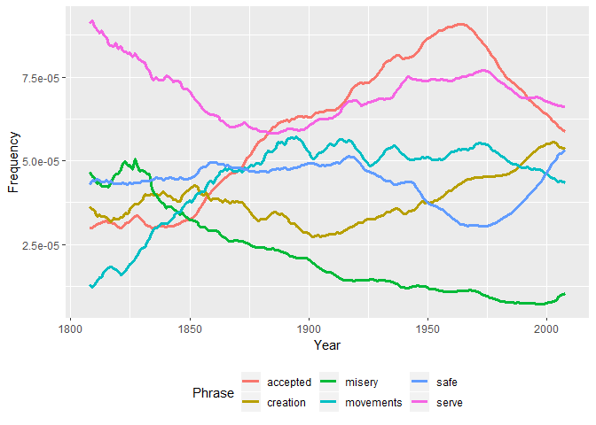

Google n-gram data & R: some methods
------------------------------------

An R-based guide to accessing & sampling Google n-gram data, with a focus on/aim of building some text structures for investigating lexical semantic change historically.

-   [1 Overview of n-gram corpus](#1-Overview-of-n-gram-corpus)
-   [2 Download-sample-aggregate](#2-Download-sample-aggregate)
-   [3 Sample-aggregate-restructure](#Sample-aggregate-restructure)
-   [4 Building historical corpora](#4-Building-historical-corpora)
-   [5 Building historical feature matrices](#5-Building-historical-feature-matrices)
-   [5 Form frequency from matrices](#4-Building-historical-corpora))

Smart approach, versus less smart approach. Sample ngram data / reduce mass ... to a size that is manageable locally.

A developing resource. ... if we wanted to engage with ngram data in earnest, we would build SQL database, etc. Here, we just want to:

-   steal some historical text data to demonstrate a set of methods,
-   take a peak into some changes in word distributions historically, and

``` r
library(tidyverse)
library(data.table)
```

------------------------------------------------------------------------

### 1 Download, sample & aggregate

> Google has a host of corpora -- here we work with the corpus dubbed the **English One Million** corpus. The corpus is comprised of texts published from the 16th century to the start of the 21st, and includes over 100 billion words. **The 5-gram corpus** is comprised of ~800 files (or sub-corpora). File composition for this corpus version is not structured alpabetically or chronologically. Instead, it seems fairly arbitrary.

To start the sampling process, we build two simple functions. The **first function** downloads & unzips a single file of the corpus to a temporary folder.

``` r
get_zip_csv <- function (url) {

  temp <- tempdir()
  zip_name <- paste0(temp, '\\', basename(url))
  download.file(url, zip_name, 
                quiet = TRUE)
  unzip(zip_name, exdir = temp)
  out <- data.table::fread(gsub('\\.zip', '', zip_name), 
                           blank.lines.skip = TRUE, 
                           quote="", 
                           encoding = 'UTF-8')
  unlink(temp) 
  out}
```

A **random portion** of the first file of the 5-gram corpus is presented below:

-   V1 = 5-gram
-   V2 = Date of publication
-   V3 = token frequency of 5-gram in sub-corpus
-   V4 = page count of 5-gram in sub-corpus
-   V5 = volume (or text frequency) count of 5-gram in sub-corpus

``` r
url <- 'http://storage.googleapis.com/books/ngrams/books/googlebooks-eng-1M-5gram-20090715-1.csv.zip'
unzipped_eg <- get_zip_csv(url)  #~11 million rows.
unzipped_eg %>% sample_n(5) %>% knitr::kable()
```

| V1                          |    V2|   V3|   V4|   V5|
|:----------------------------|-----:|----:|----:|----:|
| to be a failure !           |  1865|    3|    3|    3|
| "the independence of Persia |  1920|    3|    3|    3|
| examples could be quoted .  |  1938|    6|    6|    6|
| 4 . Can you suggest         |  1937|    4|    4|    4|
| a soluble salt with the     |  1848|    1|    1|    1|

The **second function** performs a variety of tasks with the aim of sampling & aggregating the raw 5-gram files. Function parameters & details:

-   filter sub-corpus by dates of publication
-   sample sub-corpus
-   remove 5-ngrams with punctuation
-   create new time bins
-   aggregate 5-gram frequencies per new time bins
-   sample again

Sampling procedure could certainly be more systematic. Here, we are only interested in token frequencies; once we aggregate over dates of publication, text/page frequencies become useless.

``` r
sample_ngram <- function (x, 
                          start_date, end_date, 
                          generation, 
                          samp1, samp2) {
  
  x <- x[V2 >= start_date & V2 <= end_date ]
  set.seed(99)
  x <- x[sample(1:nrow(x), samp1, 
                replace=FALSE),] 
  x <- x[grepl("^[a-z ]+$", V1, ignore.case = TRUE)] 
  #Remove grams with punctuation
  x$V9 <- cut(x$V2, seq(start_date,end_date,generation), 
              right=FALSE,
              include.lowest = TRUE,
              dig.lab = 4) #Create new time bins
  x[, V1 := toupper(V1)]
  x <- x[, list(V3 = sum(V3)), by = list(V1, V9)] 
  #Aggregate freqs to new time bins
  setnames(x, 
           old = c('V1', 'V9', 'V3'), 
           new = c('five_gram', 'quarter', 'freq'))
  set.seed(99)
  x[sample(1:nrow(x), samp2,
                replace=FALSE),]
}
```

The table below presents a random portion of the sampled/aggregated output:

``` r
unzipped_eg %>%
  sample_ngram(start_date = 1808,
               end_date = 2008,
               generation = 25,
               samp1 = 5000000,
               samp2 = 200000) %>%
  sample_n(5) %>%
  knitr::kable()
```

| five\_gram                     | quarter       |  freq|
|:-------------------------------|:--------------|-----:|
| FOR ME BY MY ASSISTANT         | \[1983,2008\] |     1|
| THE YOUNG ARE HATCHED ABOUT    | \[1858,1883)  |     7|
| THE STRONG OPPOSITION OF MANY  | \[1958,1983)  |    13|
| MURDERED THE TURNKEY ON FRIDAY | \[1858,1883)  |     8|
| YEAR OR TWO AND SEE            | \[1933,1958)  |     5|

<br>

We then **apply functions** to all ~800 files/sub-corpora, and store the output locally. Depending on connection speed, this could take a while. A good processing rate would be 3/4 files per minute. Downoading/unzipping is the limiting part of the process. Total size of processed files is ~6.7 Gb.

``` r
file_names <- c(1:799)
setwd(local_raw)

for (i in 1:length(file_names)) {
  url <- paste0('http://storage.googleapis.com/books/ngrams/books/googlebooks-eng-1M-5gram-20090715-', file_names[i], '.csv.zip')
  
  get_zip_csv(url) %>%
    sample_ngram(start_date = 1808,
                 end_date = 2008,
                 generation = 25,
                 samp1 = 5000000,
                 samp2 = 200000)%>%
    write.csv(., 
            gsub('(^.*googlebooks-)(.*)(\\.zip)', '\\2', url), 
            row.names = FALSE) 
  }
```

------------------------------------------------------------------------

### Restructure to bag-of-words

At this point, we have successfully stolen a very small portion of the 5-gram corpus derived from the 100+ billion word Google corpus. At ~6.7 Gb, it is still a bit big for use locally in R. With the goal of building n-gram-based co-occurence matrices, the next step is to restructure the 5-gram data some.

Per each file/sub-corpus generated above, here we:

-   sample 5-grams again
-   uniquely id 5-grams
-   flip 5-grams as character string to long format
-   remove stop words

> Per the table above, the 5-gram "MURDERED THE TURNKEY ON FRIDAY" occurred 8 times between 1858-1882 in the first file of the ngram corpus. The pipe below seperates each form in the ngram into five rows, assigns each row/form the frequency of the ngram (8), uniquely identifies the ngram in the sub-corpus, and removes rows in the ngram containing stopwords (here, "THE" and "ON"). The ID serves to preserve the ngram as a context of usage (or mini-text).

``` r
setwd(local_raw)
gfiles <- list.files(path=local_raw, 
                     pattern = ".csv", 
                     recursive=TRUE) 

grams <- lapply(1:length(gfiles), function (y)
  data.table::fread(gfiles[y])%>%
    sample_n(75000) %>%
    rename(ngram = five_gram) %>%
    mutate(id = as.integer(row_number())) %>%
    separate_rows (ngram, sep = ' ') %>% #Make ngram long
    filter(!ngram %in% toupper(corpuslingr::clr_ref_stops))%>% #Remove stop words
    as.data.table()
)

names(grams) <- file_names  #Store locally.
```

The **resulting data structure** is a list of data frames, with each data frame representing a sub-corpus as a bag-of-words (with frequencies aggregated by ngram constituents and generation). A sample portion of this structure is presented below.

| ngram       | quarter       |  freq|   id|
|:------------|:--------------|-----:|----:|
| DESIRE      | \[1983,2008\] |    12|    1|
| KIND        | \[1983,2008\] |    12|    1|
| PROPOSAL    | \[1883,1908)  |     2|    2|
| STRENUOUSLY | \[1883,1908)  |     2|    2|
| OPPOSED     | \[1883,1908)  |     2|    2|
| NEW         | \[1983,2008\] |     1|    3|

------------------------------------------------------------------------

### Restructure sub-corpora

The next step is to convert our list of randomly assembled sub-corpora into a list of generation-based sub-corpora. We also want to define a lexicon, and subsequently filter our corpus to only forms included in the lexicon. This last step serves to define the dimensions of our generation-based co-occurrence matrices.

First things first, we collapse our list of sub-corpora into a single corpus, and uniquely identify each 5-gram. ~3.2 Gb.

``` r
grams <- grams %>% data.table::rbindlist(idcol = 'corp') 
grams[, quarter := as.numeric(gsub("(\\[)([0-9].*)(\\,.*$)", "\\2", quarter))]
#There is a better way. 

setkey(grams, corp, id)
grams[ , id := .GRP, by = key(grams)]
grams[, corp := NULL]  #n = 120,920,432, 3.2Gb
```

Here, we define our lexicon as the 25k most frequent forms in our 5-gram corpus that occur in all eight generations.

``` r
top25k <- grams[, list(freq = sum(freq), gens = length(unique(quarter))), 
                by = list(ngram)] %>%
  filter(gens == 8 & ngram != 'NA') %>%
  arrange(desc(freq), ngram)%>%
  slice(1:25000) %>%
  data.table()
```

Then we filter the full 5-gram corpus to forms included in the lexicon, and split the corpus into a new list of data frames by generation. ~1.8 Gb.

``` r
#Reduce corpus to top25k lexicon
grams <- subset(grams, ngram %in% top25k$ngram)
setorder(grams, quarter, id)

#Split corpus by generation
grams <- split(grams, f = grams$quarter) 
grams <- lapply(grams, select, -quarter) #1.8 Gb
```

------------------------------------------------------------------------

### Building historical feature matrices

At this point, we are finished with the time- & memory-consumptive portion of the workflow. Next, we want to transform each of our sub-corpora into a feature-term (or feature-co-coccurrence) matrix.

> Represent each form in our 25k lexicon in terms of the frequencies in which they co-occur with other constituents (or features) of the 25k lexicon. Here, a given form is said to "co-occur" with a given feature when form & feature are found in the same 5-gram.

Treating each uniquely identified 5-gram as a "document," we first transform each sub-corpus into a Document-Term Matrix (DTM) using the `cast_sparse` function from the `tidytext` package. For our purposes here, this is an intermediary data structure. We then convert the DTM to a feature-co-occurrence matrix (FCM) using the `Dtm2Tcm` function from the `testmineR` package. This particular workflow is ideal when working with aggregated text structures as a starting point.

``` r
ttms <- lapply(1:8, function (y)
  
  grams[[y]] %>%
    tidytext::cast_sparse(id, 
                          ngram, 
                          freq) %>%
    textmineR::Dtm2Tcm() %>%
    .[, order(colnames(.))] %>%
    .[order(rownames(.)), ]
  
) #543.1Mb

names(ttms) <- names(grams)
```

A small portion of 25k x 25k FCM for the years 1908-1932 is presented below. Full data structure is a list of FCMs by generation.

``` r
library(Matrix)
ttms[[5]][1:10,1:20] 
```

    ## 10 x 20 sparse Matrix of class "dgCMatrix"
    ##                                                                          
    ## AA          77   .    .   .   .    .    .   .    .  . . . . . . . . . . .
    ## AARON        . 708    .   .   .    .    .   .    .  . . . . . . . . . . .
    ## AB           .   . 2409   .   .    .    .   .    .  . . . . . . . . . . .
    ## ABACK        .   .    . 703   .    .    .   .    .  . . . . . . . . . . .
    ## ABAFT        .   .    .   . 227    .    .   .    .  . . . . . . . . . . .
    ## ABANDON      .   .    .   .   . 7732    .   .    .  . . . . . . . . . . .
    ## ABANDONED    .   .    .   .   .    . 8244   .    .  . . . . . . . . . . .
    ## ABANDONING   .   .    .   .   .    .    . 599    .  . . . . . . . . . . .
    ## ABANDONMENT  .   .    .   .   .    .    .   . 3772  . . . . . . . . . . .
    ## ABANDONS     .   .    .   .   .    .    .   .    . 55 . . . . . . . . . .

### Extract form frequencies

A convenience of the FCM as a data structure is that token frequencies (in our heavily sampled corpus of 5-grams) for each form in the lexicon are stored in the diagonal of the FCM. Here, we extract these frequencies, and relativize them by the overall size of the corpus by generation. Frequencies are presented per 1 million words (ppm).

> Ppm frequencies are generally based on 1 million words of proper text, which includes stop words. Frequencies presented here are per 1 million words of non-stop, 5-gram text. So, while our frequencies have relative value, they cannot be compared to other corpora in any meaningful way. Which is fine. Just an FYI.

``` r
freqs <- lapply(1:8, function (x)
  data.frame(form = rownames(ttms[[x]]), 
             freq= diag(ttms[[x]]),
             generation = rep(names(ttms[x]), nrow(ttms[[x]])),
             stringsAsFactors = FALSE) 
  ) %>%
  bind_rows() %>%
  group_by(generation) %>%
  mutate(corpus = sum(freq)) %>%
  ungroup() %>%
  mutate(ppm = round(freq/corpus *1000000, 2))%>%
  select(-corpus)
```

**Historical frequencies** for a random sample of forms in the lexicon:

``` r
freqs %>%
  select(-freq) %>%
  spread(generation, ppm) %>%
  sample_n(5) %>%
  knitr::kable()
```

| form             |    1808|    1833|    1858|    1883|    1908|    1933|    1958|    1983|
|:-----------------|-------:|-------:|-------:|-------:|-------:|-------:|-------:|-------:|
| CIRCUMNAVIGATION |    0.44|    1.82|    0.93|    0.93|    0.42|    0.82|    0.72|    0.37|
| CHILDBIRTH       |    0.31|    0.13|    0.44|    0.45|    1.18|    1.22|    0.93|    2.76|
| WARWICK          |   12.66|    6.62|    6.91|    3.83|    2.80|    1.85|    2.46|    2.63|
| FISH             |   53.26|   61.44|   65.69|   60.80|   44.41|   47.36|   40.52|   47.59|
| SAKE             |  263.42|  417.80|  260.20|  280.17|  454.40|  221.99|  200.70|  238.91|

------------------------------------------------------------------------

### Lemmatizing feature matrix

Feature/lexicon/FCM compression.

For good measure, we next demonstrate some methods for "lemmatizing" our historical FCMs. A lemma is properly defined as a word form/part-of-speech pair, and all of its inflectional variants.

eg, 'possessed' would go away. Participle forms used in modification.

``` r
lemma_lexicon <- read.csv( url('https://raw.githubusercontent.com/skywind3000/lemma.en/master/lemma.en.txt'), 
                      header = FALSE, 
                      skip = 10, sep = '\t')%>%
  separate(V1, into = c('lemma', 'form'), sep = ' -> ') %>%
  mutate(lemma = toupper(gsub('/.*$', '', lemma)),
         form = toupper(form))%>%
  separate_rows (form, sep = ',') %>%
  filter(grepl("^[A-Z]+$", lemma)) %>%
  group_by(form) %>% slice(1) 
#some single forms are mapped to multiple lemmas -- n=136 
```

~ 25k -&gt; 16.5k via poor man's lemmatization

``` r
lex <- freqs %>% filter(generation == 1808) %>%
  left_join(lemma_lexicon) %>%
  mutate(lemma = ifelse(is.na(lemma), form, lemma)) %>%
  select(form, lemma)
```

``` r
lex %>% slice(5:12) %>% knitr::kable()
```

| form        | lemma       |
|:------------|:------------|
| ABAFT       | ABAFT       |
| ABANDON     | ABANDON     |
| ABANDONED   | ABANDON     |
| ABANDONING  | ABANDON     |
| ABANDONMENT | ABANDONMENT |
| ABANDONS    | ABANDON     |
| ABASHED     | ABASH       |
| ABATE       | ABATE       |

Lemmatize list of matrices.

``` r
library(Matrix.utils)

lemmatize_matrix <- function (x) {
  colnames(x) <- lex$lemma
  rownames(x) <- lex$lemma
  y <- t(aggregate.Matrix(x, colnames(x), fun = 'sum'))
  aggregate.Matrix(y, colnames(x), fun = 'sum')
}
```

``` r
ttms_lemmed <- lapply(1:8, function (z)
  ttms[[z]] %>% lemmatize_matrix()) 
```

``` r
ttms_lemmed[[5]][1:10,1:20]
```

    ## 10 x 20 sparse Matrix of class "dgCMatrix"

    ##    [[ suppressing 20 column names 'AA', 'AARON', 'AB' ... ]]

    ##                                                                           
    ## AA          77   .    .   .   .     .    .   .    .   . . . . . . . .  . .
    ## AARON        . 708    .   .   .     .    .   .    .   . . . . . . . .  . .
    ## AB           .   . 2409   .   .     .    .   .    .   . . . . . . . . 12 .
    ## ABACK        .   .    . 703   .     .    .   .    .   . . . . . . . .  . .
    ## ABAFT        .   .    .   . 227     .    .   .    .   . . . . . . . .  . .
    ## ABANDON      .   .    .   .   . 16630    .   .    .   . . . . . . . .  . .
    ## ABANDONMENT  .   .    .   .   .     . 3772   .    .   . . . . . . . .  . .
    ## ABASH        .   .    .   .   .     .    . 118    .   . . . . . . . .  . .
    ## ABATE        .   .    .   .   .     .    .   . 1092   . . . . . . . .  . .
    ## ABATEMENT    .   .    .   .   .     .    .   .    . 729 . . . . . . .  . .
    ##              
    ## AA          .
    ## AARON       .
    ## AB          .
    ## ABACK       .
    ## ABAFT       .
    ## ABANDON     .
    ## ABANDONMENT .
    ## ABASH       .
    ## ABATE       .
    ## ABATEMENT   .

------------------------------------------------------------------------

### Comparing some (relative) frequencies

``` r
search <- c( 'accepted', 'creation', 'misery', 'movements', 'safe','serve')

freqs %>%
  filter(form %in% toupper(search)) %>%
  ggplot(aes(x= generation, y = ppm, group = form, color = form)) +
  geom_line(size=1.25) +
  #expand_limits(y=0)+
  theme(axis.text.x=element_text(angle = 45, hjust = 1),
        legend.position = 'bottom')
```


Compare to freq from one of the viewer packages.

``` r
#devtools::install_github("seancarmody/ngramr")
ngramr::ngram(search, year_start = 1808) %>%
  ggplot(aes(x=Year, y=Frequency, colour=Phrase)) +
  geom_line(size=1.25) +
  theme(legend.position = 'bottom')
```



------------------------------------------------------------------------

### Summary
